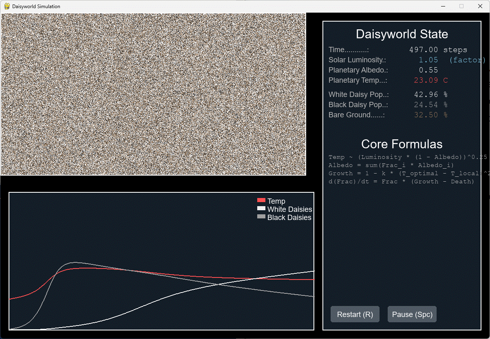

# Daisyworld: An Interactive Visual Simulation


 
This project is an interactive, visual experiment based on James Lovelock's **Daisyworld model**, created with Python and the Pygame library. It provides a clear, hands-on demonstration of the core concepts of the **Gaia hypothesis**; the idea that life can collectively and unintentionally self-regulate its environment to maintain habitable conditions.


---

## The Concept

Daisyworld is a hypothetical planet orbiting a star. The only life on this planet are two species of daisies:

* **Black Daisies:** Absorb sunlight, which warms their local surroundings and the planet as a whole.
* **White Daisies:** Reflect sunlight, which cools their local surroundings and the planet.

Both species have the same optimal temperature for growth (22.5°C) and cannot survive if it gets too hot or too cold. The simulation demonstrates how the competition between these two species creates a feedback loop that stabilizes the planet's temperature under different conditions.

---

## Features

* **Interactive Settings:** Before each run, modify key variables like daisy albedo, death rate, and solar luminosity to design your own experiments.
* **Dynamic Solar Model:** Simulate a star that warms over time, or set the "Luminosity Change" to zero for a constant sun.
* **Live Graphing:** A real-time chart displays the populations of both daisy species and the average planetary temperature.
* **Dynamic End Scenarios:** The simulation automatically detects the outcome of your experiment and provides a specific explanation, whether it's a heat death, a freeze death, a stable equilibrium, or a failure for life to start at all.
* **Configurable Stability:** Set how many turns of unchanging populations are needed before the simulation concludes that a stable state has been reached.



---

## How to Run

### Prerequisites

* Python 3.x
* Pygame library

### Installation

1.  **Install Python:** If you don't have Python, download it from [python.org](https://www.python.org/downloads/).

2.  **Install Pygame:** Open your terminal or command prompt and run the following command:
    ```bash
    pip install pygame
    ```

3.  **Run the Simulation:** Navigate to the project directory in your terminal and run the script:
    ```bash
    python Daisyworld.py
    ```
    (Note: The script name may vary depending on how you saved it).

---

## Controls

* **Mouse Clicks:** Use the `+` / `-` buttons on the settings screen to adjust variables. Click "Load Defaults" or "Start Simulation" to proceed.
* **R KEY:** From the simulation or end screen, press 'R' to return to the settings screen and run a new experiment.

---

## How to Experiment

The settings screen allows you to explore the limits of the Gaian system. Try these experiments:

* **Classic Daisyworld:** Use the default settings. Watch as the daisies battle to regulate the temperature against a warming sun, eventually succumbing to a "heat death."
* **A Stable World:** Set the "Luminosity Change" to `0.0`. The daisies will find an equilibrium and maintain a stable temperature. The simulation will end once the "Stability Turns" condition is met.
* **A Frozen Planet:** Set the "Start Luminosity" to a very low value (e.g., `0.6`). Can the black daisies generate enough heat to survive, or will the planet enter a "freeze death"?
* **Inefficient Daisies:** Lower the "Heating Effect" or make the albedos of the white and black daisies very similar. Can life still regulate the climate effectively?
